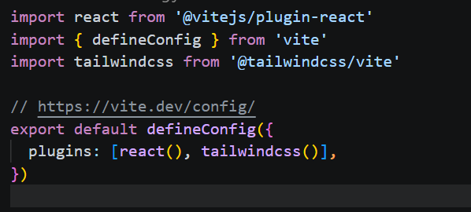

# Project Setup

1. create two folder frontend and backend
2. go to frontend `cd frontend`
   - type `npm crete vite@latest`
   - press `Y` if asked to install
   - enter `.` in project name
   - select 'React' as framework from arrow key
   - select JavaScript from varient by arrow key
   - select ESLint by arrow key
   - select Yes and press enter
3. setup tailwind in react project
   -  install tailwind by `npm install tailwindcss @tailwindcss/vite`
   -  update vite.config.js as below image
     !()
   -  add `@import "tailwindcss` top of index.css
   - remove all contents of index.css then write `@import "tailwindcss;"` top of index.css

in React style can be added into html by class name bcz class is a predefined keyword in react 

when js function returns directly html content,called component 
1.START WITH CAPITAL LETTER
2.IT MUST RETURN HTML 
3.MUST BE CLOSE AT THE CALLING TIME
4.IT CAN BE USE ANYWHERE AND ANYTIME
